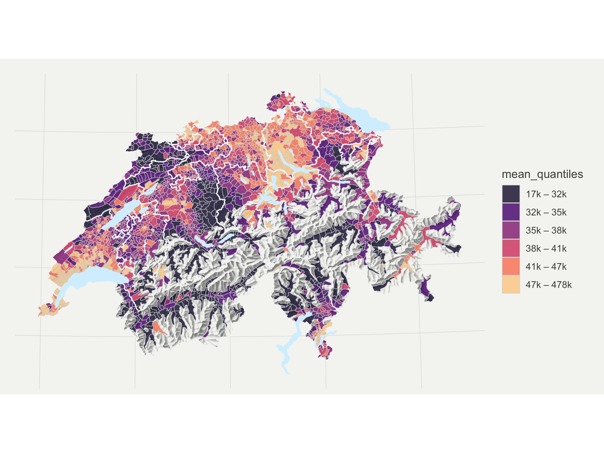
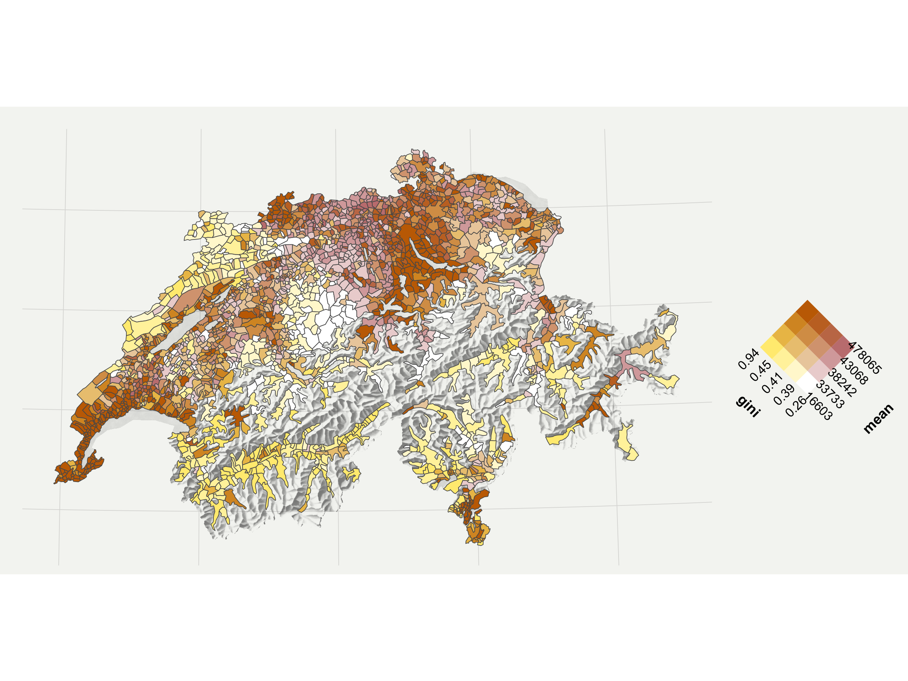
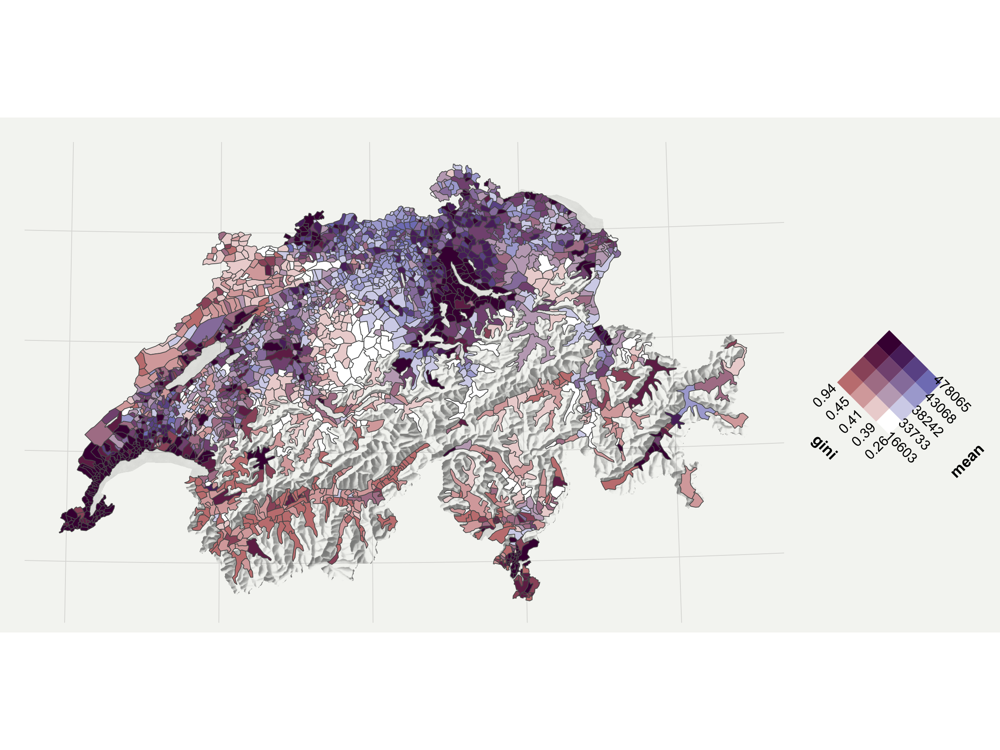

- [ggswitzerland](#ggswitzerland)
  - [`theme_map()`](#theme_map)
  - [data prep](#data-prep)
    - [we need to include it in the
      package](#we-need-to-include-it-in-the-package)
  - [`stamp_mountains()`](#stamp_mountains)
  - [`geom_*()` and `stamp_*()` functions using
    `ggregions::write_*(ref_data = ?)`](#geom_-and-stamp_-functions-using-ggregionswrite_ref_data--)
- [packaging](#packaging)
- [Use ggswitzerland! A replication of Timo’s
  work](#use-ggswitzerland-a-replication-of-timos-work)
  - [A little more styling](#a-little-more-styling)
- [Bonus: {ggswitzerland} X
  {ggincerta}](#bonus-ggswitzerland-x-ggincerta)

<!-- README.md is generated from README.Rmd. Please edit that file -->

# ggswitzerland

Is inspired and uses much of the code in ‘[Bivariate maps with ggplot2
and
sf](https://timogrossenbacher.ch/bivariate-maps-with-ggplot2-and-sf/)’
with the source available in the
[repo](https://github.com/grssnbchr/bivariate-maps-ggplot2-sf?tab=readme-ov-file).

The main goal is to be able to more succinctly create the following
plot, using new layers (`geom_*()` and `stamp_*()` functions) that are
defined in {ggswitzerland}. An original plot (not bivariate) from the
blogpost:


The novel functionality in {ggswitzerland} is `geom_muni()` which can be
used to create a map from flat data (no boundary information). Creating
functions like `geom_muni()` can be done easily using the {ggregions}
package.

``` r
flat_income_data |> # no boundary data is included
  ggplot() +
  aes(muni_name = municipality,
      fill = income_levels) + 
  geom_muni()     # knows municipality boundaries
```

Annotation layers `stamp_relief()` (and alias `stamp_mountains()`) as
well as `stamp_lake()` and `stamp_canton()` are also specified to allow
the map to be fully reproduced.

## `theme_map()`

This pretty much verbatim from the blog, but *does* add palette
definition, which is new in ggplot2 4.0.0. We go with magma since it
looks great in the target plot and is colorblind friendly!

``` r
#' @export
theme_map <- function(...) {
  theme_minimal() +
  theme(
    palette.fill.continuous = "magma",
    palette.fill.discrete = "magma",
    palette.fill.binned = "magma",
    palette.color.continuous = "magma",
    palette.color.discrete = "magma",
    palette.color.binned = "magma",
    text = element_text(color = "#4e4d47"),
    axis.line = element_blank(),
    axis.text.x = element_blank(),
    axis.text.y = element_blank(),
    axis.ticks = element_blank(),
    panel.grid.major = element_line(color = "#dbdbd9", size = 0.2),
    panel.grid.minor = element_blank(),
    plot.background = element_rect(fill = "#f5f5f2",
                                   color = NA),
    panel.background = element_rect(fill = "#f5f5f2",
                                    color = NA),
    legend.background = element_rect(fill = "#f5f5f2",
                                     color = NA),
    plot.margin = unit(c(.5, .5, .2, .5), "cm"),
    panel.border = element_blank(),
    panel.spacing = unit(c(-.1, 0.2, .2, 0.2), "cm"),
    legend.title = element_text(size = 11),
    legend.text = element_text(size = 9, hjust = 0,
                               color = "#4e4d47"),
    plot.title = element_text(size = 15, hjust = 0.5,
                              color = "#4e4d47"),
    plot.subtitle = element_text(size = 10, hjust = 0.5,
                                 color = "#4e4d47",
                                 margin = margin(b = -0.1,
                                                 t = -0.1,
                                                 l = 2,
                                                 unit = "cm"),
                                 debug = F),
    plot.caption = element_text(size = 7,
                                hjust = .5,
                                margin = margin(t = 0.2,
                                                b = 0,
                                                unit = "cm"),
                                color = "#939184"),
    ...
  )
}
```

## data prep

Here’s some info about the data provinance, also from the blog.

> Various geodata from the Swiss Federal Statistical Office (FSO) and
> the Swiss Federal Office of Topography (swisstopo) depicting Swiss
> borders as of 2015 are used herein.

- `input/gde-1-1-15.*`: These geometries do not show the political
  borders of Swiss municipalities, but the so-called “productive” area,
  i.e., larger lakes and other “unproductive” areas such as mountains
  are excluded. This has two advantages: 1) The relatively sparsely
  populated but very large municipalities in the Alps don’t have too
  much visual weight and 2) it allows us to use the beautiful raster
  relief of the Alps as a background. These data are now freely
  available [from the
  FSO](https://www.bfs.admin.ch/bfs/en/home/statistics/regional-statistics/base-maps/cartographic-bases.assetdetail.7546178.html).
  Click on “Download map (ZIP)”, the polygon files are in
  `/PRO/01_INST/Vegetationsfläche_vf/K4_polgYYYYMMDD_vf`; different
  timestamps are available, the 2015 data used here stem from another
  data set.
- `input/g2*`: National (`s`) as well as cantonal borders (`k`) and
  lakes (`l`). Available
  [here](https://www.bfs.admin.ch/bfs/de/home/dienstleistungen/geostat/geodaten-bundesstatistik/administrative-grenzen/generalisierte-gemeindegrenzen.html).
- (Hillshaded) relief: This is a freely available GeoTIFF from
  [swisstopo](https://shop.swisstopo.admin.ch/en/products/maps/national/digital/srm1000).
  For the sake of simplicity, it was converted to the “ESRI ASCII”
  format using
  `gdal_translate -of AAIGrid 02-relief-georef.tif 02-relief-ascii.asc`
  on the CLI. The `raster` can read that format natively, without the
  need of explicitly installing the `rgdal` package – which is not the
  case for GeoTIFF files.

Now data prep that is appropriate for the ggregions methodology.

``` r
library(tidyverse)
# read cantonal borders
canton_geo <- read_sf("input/g2k15.shp") |>
  dplyr::select(canton_name = KTNAME, canton_num = KTNR)

# read country borders
country_geo <- read_sf("input/g2l15.shp") |> 
  dplyr::select(iso_chr = CH_ISO)

# read lakes
lake_geo <- read_sf("input/g2s15.shp") |>
  dplyr::select(lake_name = GMDNAME, lake_num = GMDNR)


# read productive area (2324 municipalities)
muni_prod_geo <- read_sf("input/gde-1-1-15.shp") |> 
  dplyr::select(geometry, muni_name = Secondary_, muni_id = BFS_ID)

library(raster)
# read in raster of relief
relief <- raster("input/02-relief-ascii.asc") %>%
  # hide relief outside of Switzerland by masking with country borders
  mask(country_geo) %>%
  as("SpatialPixelsDataFrame") %>%
  as.data.frame() %>%
  dplyr::rename(value = `X02.relief.ascii`) |> 
  mutate(value_01 = (value - min(value))) |>
  mutate(value_01 = value_01/max(value_01)) |>
  mutate(value_point6_0 = value_01 * .6) |>
  mutate(value_point6_0 = 1 - value_point6_0 - .4)
```

### we need to include it in the package

``` r
usethis::use_data(relief, overwrite = T)
usethis::use_data(canton_geo, overwrite = T)
usethis::use_data(country_geo, overwrite = T)
usethis::use_data(lake_geo, overwrite = T)
usethis::use_data(muni_prod_geo, overwrite = T)
```

## `stamp_mountains()`

``` r
#' @export
stamp_relief <- function(...){ 
  
  annotate(geom = "raster",
      x = relief$x,
      y = relief$y,
      alpha = relief$value_point6_0,
    ...)
  
}

#' @export
stamp_mountains <- stamp_relief
```

## `geom_*()` and `stamp_*()` functions using `ggregions::write_*(ref_data = ?)`

Install {ggregions} if you don’t already have the package.

``` r
remotes::install_github("EvaMaeRey/ggregions")
```

``` r
#' @export
geom_muni <- ggregions::write_geom_region_locale(ref_data = muni_prod_geo)

#' @export
stamp_canton <- ggregions::write_stamp_region_locale(canton_geo)

#' @export
stamp_lake <- ggregions::write_stamp_region_locale(lake_geo)
```

# packaging

``` r
knitrExtra::chunk_to_dir(
  c("stamp_mountains", 
    "geom_regions_functions",
    "theme_map")
  )
```

``` r
devtools::document(".")
devtools::check(".")
devtools::install(".", upgrade = "never")
```

# Use ggswitzerland! A replication of Timo’s work

``` r
remove(list = ls())

data <- readr::read_csv("input/data.csv")

head(data)
#> # A tibble: 6 × 4
#>   municipality       bfs_id  mean  gini
#>   <chr>               <dbl> <dbl> <dbl>
#> 1 Aeugst am Albis         1 56077 0.523
#> 2 Affoltern am Albis      2 40365 0.434
#> 3 Bonstetten              3 50364 0.415
#> 4 Hausen am Albis         4 47717 0.47 
#> 5 Hedingen                5 50436 0.453
#> 6 Kappel am Albis         6 48833 0.484
```

``` r
library(tidyverse)
# define number of classes
no_classes <- 6

# extract quantiles
quantiles <- data %>%
  pull(mean) %>%
  quantile(probs = seq(0, 1, length.out = 6 + 1)) %>%
  as.vector() # to remove names of quantiles, so idx below is numeric

# here we create custom labels
labels <- imap_chr(quantiles, function(., idx){
  return(paste0(round(quantiles[idx] / 1000, 0),
                             "k",
                             " – ",
                             round(quantiles[idx + 1] / 1000, 0),
                             "k"))
})

# we need to remove the last label 
# because that would be something like "478k - NA"
labels <- labels[1:length(labels) - 1]

data <- data |> 
  mutate(mean_quantiles = 
         cut(mean,
               breaks = quantiles,
               labels = labels,
               include.lowest = T))

data |> head()
#> # A tibble: 6 × 5
#>   municipality       bfs_id  mean  gini mean_quantiles
#>   <chr>               <dbl> <dbl> <dbl> <fct>         
#> 1 Aeugst am Albis         1 56077 0.523 47k – 478k    
#> 2 Affoltern am Albis      2 40365 0.434 38k – 41k     
#> 3 Bonstetten              3 50364 0.415 47k – 478k    
#> 4 Hausen am Albis         4 47717 0.47  47k – 478k    
#> 5 Hedingen                5 50436 0.453 47k – 478k    
#> 6 Kappel am Albis         6 48833 0.484 47k – 478k
```

``` r
library(tidyverse)
library(ggswitzerland)
theme_map() |> theme_set()

data |> 
  ggplot() + 
  stamp_mountains() + 
  aes(muni_name = municipality) +
  geom_muni() + 
  aes(fill = mean_quantiles) +
  stamp_canton(fill = "transparent") + 
  stamp_lake(fill = "#D6F1FF")
```


## A little more styling

``` r
default_caption <- paste0("Map CC-BY-SA; Code: ",
                          "github.com/grssnbchr/bivariate-maps-ggplot2-sf",
                          "\nAuthors: Timo Grossenbacher",
                          " (@grssnbchr), Angelo Zehr (@angelozehr)",
                          "\nGeometries: ThemaKart BFS and swisstopo;",
                          " Data: ESTV, 2015")
```

``` r
data |> 
  ggplot() + 
  stamp_mountains() + 
  aes(muni_name = municipality) +
  geom_muni(alpha = .8, color = "lightgrey") +
  aes(fill = mean_quantiles) +
  stamp_canton(fill = "transparent", 
               color = "whitesmoke", 
               linewidth = .5) + 
  stamp_lake(fill = "#D6F1FF", color = "transparent") + 
  theme_map() + 
  scale_fill_viridis_d(begin = .1, end = .9,
                       option = "magma")
```



``` r

last_plot() +
  labs(x = NULL,  y = NULL,
       fill = "Average\nincome in CHF",
       title = "Switzerland's regional income",
       subtitle = "Average yearly income in Swiss municipalities, 2015",
       caption = default_caption
       ) 
```


Original:


------------------------------------------------------------------------

# Bonus: {ggswitzerland} X {ggincerta}

``` r
library(ggincerta) # for duo and scale_*_bivariate

data |> 
  ggplot() + 
  stamp_mountains() + 
  aes(muni_name = municipality) +
  geom_muni() + 
  aes(fill = duo(gini, mean))
```



``` r

last_plot() + 
  scale_fill_bivariate(colors = c("darkred", "navy"))
```



Original:


